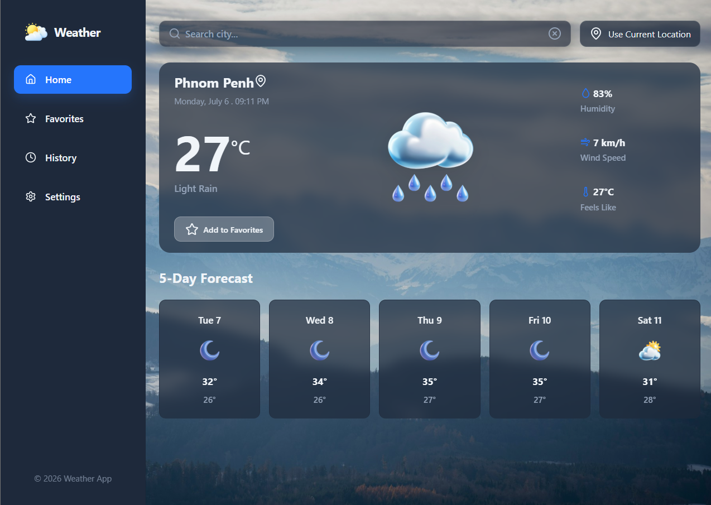

# SkyFlow — Real-Time Weather Forecast App

A sleek, lightweight, and modern weather dashboard built with **Vanilla JavaScript (ES Modules)**. **SkyFlow** provides highly accurate real-time weather reports and 5-day forecasts with a stunning fluid **Glassmorphism UI/UX** optimized primarily for a mobile-first responsive dashboard experience.


---

## 📝 Description

**SkyFlow** is engineered to eliminate the heavy bundle sizes of standard modern frameworks while retaining clean, scalable layout architectures. It leverages native web modules and styling hooks to build an interactive, high-fidelity experience. The application queries global weather grids via asynchronous API pipelines, parsing immediate conditions alongside a multi-day outlook, while enabling high-tier user features like state persistence, dynamic geolocation tracking, responsive localized configurations, and multi-language support.

---

## ✨ Features

- 🌍 **Real-Time Weather Tracks**: Queries up-to-the-minute atmospheric metrics (current temperature, humidity, wind velocity, and perceived temperature indexes).
- 📅 **Advanced 5-Day Forecasts**: Aggregates multi-timestamp data feeds into clean day-by-day blocks detailing high and low temperature variants.
- 📍 **Smart GPS Geolocation**: Fast-tracks proximity scans using native device telemetry via standard browser `Geolocation API` integrations.
- 💖 **Localized Favorites Sync**: Bookmarks targeted international nodes directly inside standard client-side `localStorage` modules for instant hot reloads.
- 📜 **Chronological Search Logs**: Implements smart cache queues detailing query histories mapped across semantic "Today", "Yesterday", and absolute date flags.
- 🌐 **Full Multi-Language Localization**: Features quick-toggle support for localized systems targeting structural **English (en)** and **Khmer (km)** text fields.
- ⚙️ **Modular User Preferences**: Modifies presentation values across multi-unit specifications (°C / °F metrics, km/h / mph velocities, 12h/24h time stamps, and live push alert permissions).
- 📱 **Mobile-First Glassmorphic Engine**: Built utilizing custom design tokens, fluid layouts, and blur layers mapping native screen viewports seamlessly.

---

## 🛠️ Tech Stack

- **Core Layer**: HTML5 (Semantic Structure).
- **Styling Architecture**: CSS3 (Design Tokens, Custom Properties, Fluid Layout Viewports via CSS `clamp()`, Flexbox, and Grid Models).
- **Application Logic**: Vanilla JavaScript (ES6+ Modules, Object-Oriented Architecture, Async/Await Fetch API Flow).
- **Bundler & Build Tool**: Vite (Ultra-fast modern development server environment).
- **Icon Assets**: Lucide Icons & Tailored Weather Visual Resource Sets.

---

## 🚀 Installation

Follow these steps to replicate the staging environments locally on your hardware:

1.Extract Workspace Source

```bash
git clone https://github.com/chea-saktra/skyflow-weather-app.git

```

2.Navigate to the project folder

```bash
cd skyflow-weather-app
```

3.Provision Dependencies

```bash
npm install
```

4.Setup Runtime Configurations (.env)

Before running the application, you need to obtain a free API key from OpenWeatherMap.

- Go to [OpenWeatherMap Sign Up Page](https://home.openweathermap.org/users/sign_up) and create a free account.
- Navigate to the **API keys** tab in your dashboard and generate your unique key.
- Create an environment file named `.env` in your root workspace directory and paste your authorization keys as follows:

```env
VITE_WEATHER_API_KEY=your_openweathermap_api_key_goes_here
VITE_BASE_URL=https://api.openweathermap.org/data/2.5/
```

5.Execute Development Services

```bash
npm run dev
```

Open your preferred browser engine and point your active network configurations to: `http://localhost:5173`

---

## 💻 Usage

- **Querying Nodes**: Input target parameters inside the Navbar entry bars or access quick location triggers (_Use My Location_) to fire automated localized GPS lookups.
- **Managing Hot Nodes**: Click the favorite button inside dashboard widgets to commit specific entries into rapid access arrays or scrub the storage vectors from the central parameters console.
- **Customizing Ecosystem Presets**: Head over to the system configuration views from the sidebar tabs to switch target language settings, scale conversions, or delete cache logs completely.

---

## 📂 Project Structure

The project maps clean development separations adhering to explicit component boundaries and modular controller structures:

```txt
├── assets/
│   └── weather-icons/         # Customized graphical weather icon sets
├── src/
│   ├── components/            # Isolated UI View Layer Components (Navbar, Sidebar, Weather, Forecast, etc.)
│   ├── styles/                # CSS Modular Architecture Setup (Tokens, Reset, and Component Styles)
│   ├── utils/                 # Utilities and Persistent Systems (API, Favorites, History, Translations)
│   ├── app.js                 # Central Application Initializer and state coordinator
│   └── main.js                # Global programmatic Entry Point
├── index.html                 # Main master page container
└── package.json               # System configuration parameters file
```

---

## 📸 Screenshots



## 🌐 Live Demo

An updated deployment of the latest pipeline configurations can be explored publicly via the link below: 🔗

[Explore SkyFlow Live Deployment](https://skyflow-weather-app-zl9g.vercel.app/)

---

## 📄 License

This development architecture is distributed publicly under standard **MIT License** parameters. Explore the localized `LICENSE` configurations file for detailed operational parameters.
